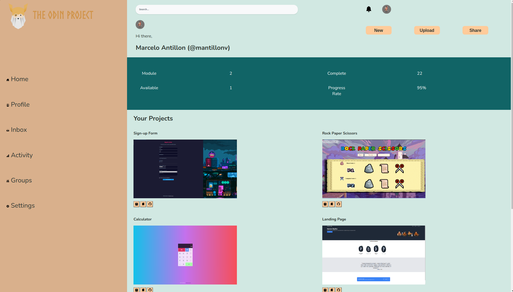

# Admin-Dashboard
Grid layout Admin Dashboard for The Odin Project 🥷

TOP Intermediate HTML and CSS final project. Create an **Admin Dashboard** with the corresponding elements:

- Layout should include a sidebar, header and main-content containers.
- Apply Grid properties and utilize Nesting.
- Gather external assets for your webpage.

<h2>Screenshot:</h2>
 